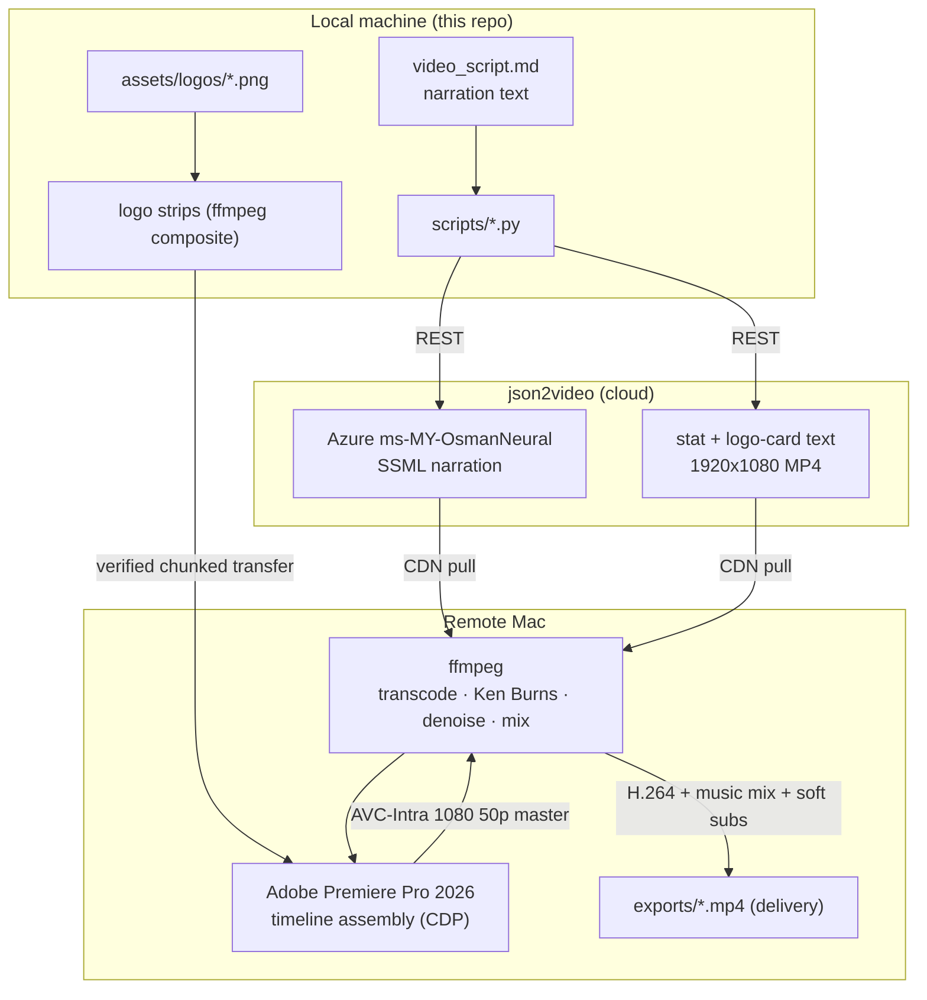
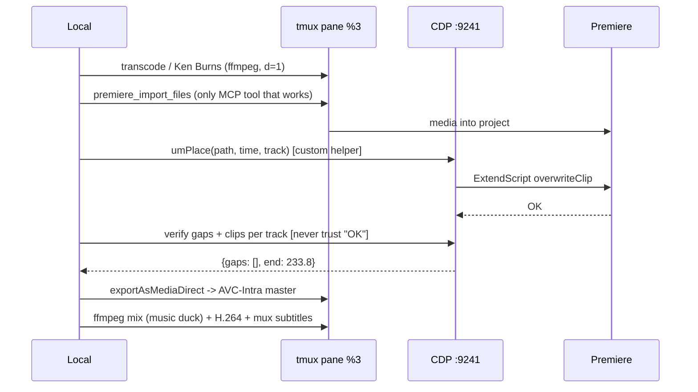

# UM Cares Report Video — RU2025-T323A

Production pipeline for the UM Cares community-programme report video
**"Amanah di Dunia Digital: Lindungi Diri dan Keluarga daripada Scam Siber"**.

Narration is AI-generated Bahasa Malaysia (Azure `ms-MY-OsmanNeural` through
json2video), statistic cards and title cards are rendered from JSON, logo
lockups are composited with ffmpeg, and the edit itself is assembled in Adobe
Premiere Pro 2026 on a **remote Mac**, driven programmatically over CDP.

| | |
|---|---|
| **Deliverable** | `UMCares_RU2025-T323A_v8.mp4` (remote `exports/`) |
| **Duration** | 233.8s (3:54) — brief allows max 4:00 |
| **Format** | 1920×1080 @ 50fps H.264, AAC stereo, ~159 MB |
| **Loudness** | −16.6 LUFS integrated, LRA 13.9 |
| **Subtitles** | soft `mov_text` track (toggleable, lang `msa`) + `.srt` sidecar |
| **Music** | `Steps_Toward_Common_Ground.mp3`, ducked under narration |
| **Logos** | real lockups on opening + closing cards (UM/MOHE/AYG, Yayasan Taqwa/ICYM/UM Press) |

Version history: v3 (207.6s, first full cut) → v4 (210.3s, ICYM/En Fikri) →
v5 (233.8s) → v6 (music bed added, −16.4 LUFS) → v7 (logo compositing fix,
En Fikri sync) → **v8** (music-ducking boundary fixed at 228s, user SRT edits
verified in-file).

---

## 1. Where things live

The repo holds **source and scripts only**. All media — footage, photos, the
Premiere project, masters — lives on the remote Mac and is gitignored.

```
DrMadihah/                          THIS REPO (source + scripts)
├── .env                            API keys            [gitignored]
├── .env.example                    template            [tracked]
├── assets/logos/*.png              brand marks         [tracked]
├── scripts/                        the pipeline        [tracked]
│   ├── j2v_voice.py                narration  (Azure ms-MY-OsmanNeural SSML)
│   ├── j2v_cards.py                stat + logo-card text (json2video)
│   ├── j2v_test.py                 API smoke test (--check / --render)
│   ├── make_logo_strip.py          logo lockup strips, local composite (ffmpeg)
│   ├── make_logo_cards.py          composite strip into card frame
│   ├── make_srt.py                 subtitles from real audio timings
│   └── tts_generate.py             Qwen TTS (fallback, superseded by Azure)
├── video/
│   ├── video_script.md             narration source of truth
│   ├── video_edit_plan.md          the delivered cut, clip by clip
│   ├── video_subtitles.srt         final SRT (user-edited)      [tracked]
│   ├── video_music_brief.md        music spec with real cue sheet
│   ├── cards/                      strips + rendered cards       [gitignored]
│   └── voiceover/                  narration + auditions         [gitignored]
├── mcp_client.py, mcp_ping.py, ... remote MCP/CDP probe scripts [tracked]
└── AdobePremiereProMCP/            upstream MCP server           [gitignored]

REMOTE  dsaopjfs-MacBook-Air:/Users/irpan/Projects/DrMadihah/
├── assets/
│   ├── Photos-1-001/               ORIGINAL camera media  <- do not edit from
│   ├── edit_ready/                 H.264 transcodes + Ken Burns  <- USE THIS
│   ├── vo/                         narration + cleaned testimonials
│   ├── cards/                      stat + logo cards (band slot)
│   └── music/                      Steps_Toward_Common_Ground.mp3 (bed)
├── project/DrMadihah.prproj        Premiere project (UMCares_EDIT sequence)
└── exports/                        masters (AVC-Intra 1080 50p) + delivery MP4s
```

**Voiceover route:** json2video renders Azure `ms-MY-OsmanNeural` from SSML.
Qwen-TTS (`qwen3-tts-flash`) still works — 6 auditions generated — but was
abandoned: no native Malay voice, and the deployment's `qwen-tts` model doesn't
exist. `.env` must use `JW2V`-style keys for json2video and the Qwen key as
`QWEN_API_KEY` (fallback only).

---

## 2. How the pieces fit



**Why this shape:** Premiere is good at the timeline and bad at text;
json2video is the opposite. ffmpeg does everything neither can. The remote
never receives large files from us — it pulls renders straight from the
json2video CDN; only the small logo strips travel over the tmux channel.

**Audio architecture (final mix, in ffmpeg):** music starts at t=25s (past its
soft intro; it measures −20.9 dB at 0 rising to −11.9 dB by 140s) and is
crossfaded back into itself since the 169.6s track is shorter than the 233.8s
cut. Ducking schedule: **−20 dB under narration, −18 dB under stat cards,
−25 dB under testimonials, −3 dB gain on music-only cards** (measured section
mean −18.7 dB). Ducking must hold until the narration actually ends — the
closing card at 222s vs voice through 228s is exactly the bug that produced
the loud-music complaint on v7.

---

## 3. Driving the remote

There is **no SSH key** and **no scp**, but both machines share a Tailscale
tailnet (remote `dsaopjfs-macbook-air` / `100.111.203.62`). Premiere runs on
the other Mac and is driven through two channels:

```
  this machine                          dsaopjfs-MacBook-Air
  ────────────                          ────────────────────

  tmux send-keys ──────────────────────► shell in tmux pane %3
  tmux pipe-pane ◄────────────────────── stdout (local log file)
        │
        │   shell commands, ffmpeg, file ops, base64 transfers
        ▼
  node cdp.js ─────────────────────────► Chrome DevTools :9241
                                              │
                                         CEP panel (Premiere)
                                              │
                                         custom helpers ──► timeline
```

- **tmux pane `%3`** — a live SSH session. Read output via `pipe-pane` to a
  local file, *never* `capture-pane`; an SSH window resize drops the pane to a
  narrow width and capture wraps/corrupts long output.
- **CDP on port 9241** — Chrome DevTools attached to the Premiere CEP panel.
  This is what actually edits the timeline, using **custom path-based
  helpers** (see gotchas — the MCP server's place/edit tools cannot work).
  Requires `.debug` in the extension directory (see gotchas).
- **Files** — anything under ~20 KB travels as base64 over the pane in
  2000-char chunks with `wc -c` verification per chunk and truncate+retry on
  mismatch (naive chunking silently drops input). Large media never crosses
  this channel; the remote pulls it from the json2video CDN instead.



---

## 4. Usage

### Setup

```bash
cp .env.example .env          # then fill in the keys
```

Keys required: `JSON2VIDEO_API_KEY` (renders + Azure voices). `QWEN_API_KEY`
is the Qwen fallback TTS. `JSON2VIDEO_ENDPOINT` defaults to
`https://api.json2video.com/v2/movies`.

```bash
python3 scripts/j2v_test.py --check     # confirms auth; renders nothing
```

### Narration

Text lives in the `SCENES` list inside `scripts/j2v_voice.py`.

```bash
# inspect the generated SSML without spending render credits
python3 scripts/j2v_voice.py --scenes --show-ssml

# render every scene (delivered settings: pitch 0%, rate 0%, flow A, no fillers)
python3 scripts/j2v_voice.py --scenes --no-fillers --pitch "0%" --rate "0%"

# render one scene only
python3 scripts/j2v_voice.py --scenes --one s4b_icym --no-fillers

# poll a render
python3 scripts/j2v_voice.py --status <project_id>
```

Voice is `ms-MY-OsmanNeural` at **natural pitch** (0%) — the +16% "young"
variants were abandoned. The SSML layer: `UM`, `PPR`, `ICYM` spelled out via
`<say-as interpret-as="characters">`; `scam siber` → `<lang
xml:lang="en-US">scam cyber</lang>` (English *spelling*, or the English voice
mangles it); non-final periods rewritten to commas so Azure uses continuation
contours instead of a falling terminal; per-scene `<emphasis>` only on the
closing phrase of scenes 2/4/7/8.

### Cards

```bash
python3 scripts/j2v_cards.py --dry              # preview JSON, no spend
python3 scripts/j2v_cards.py --render           # both stat cards
python3 scripts/j2v_cards.py --render --only s5
python3 scripts/j2v_cards.py --render --only logos
```

Logo cards are two-stage: json2video renders title text on a navy background
**with no logo band reserved in the text layout** (the band composites at
y≈862, below the text — a band at y=300 covers the title), then ffmpeg
composites the strip built locally:

```bash
python3 scripts/make_logo_strip.py    # builds strip_open.jpg / strip_close.jpg
python3 scripts/make_logo_cards.py    # composite strip into card frame
```

The strips themselves contain white-band lockups (UM/MOHE/AYG flat and
trimmed; Yayasan Taqwa is 334×87 and overflows a height-matched slot — trim
whitespace then *contain* width+height, don't match heights). AYG is black
artwork on transparency and disappears on navy — keep it in the white band.

### Subtitles

```bash
python3 scripts/make_srt.py
```

Reads the real narration WAVs, finds sentence boundaries by silence detection,
and writes cues at the timeline offsets in `PLACEMENT`. **Re-run whenever any
scene moves** — the pre-existing SRT was timed to an abandoned 3:45 storyboard
and drifted badly. The final SRT carries your hand edits ("scam cyber" →
"penipuan cyber", 172 cues).

Those hand edits are exactly what the next render overwrites, so the CLI now
compares the two sides instead of trusting them to agree:

```bash
umcares script check --file recipes/v10.json --srt video/video_subtitles.srt
```

Per scene it reports `ok` / `edited` (punctuation only) / `drift` (reworded) /
`shifted` (right words, wrong window — a stale SRT) / `missing`. To keep an
edit, put it in the recipe: `umcares script export`, edit `script.md`, then
`umcares script import`. See `umcares/README.md` → *The script*.

---

## 5. Gotchas

These each cost significant debugging. Read before changing anything.

**VP9 footage imports as audio-only.**
Premiere imports VP9-in-MP4 (the Google Photos download re-encode) without
error, takes the audio, and **silently drops the video** — `overwriteClip`
even returns success. 11 of 15 original clips hit this. Always transcode first
and edit from `assets/edit_ready/`:

```bash
ffprobe -v error -select_streams v:0 -show_entries stream=codec_name -of csv=p=0 in.MP4
ffmpeg -i in.MP4 -c:v libx264 -preset medium -crf 16 -pix_fmt yuv420p -r 50 \
       -c:a aac -b:a 192k -movflags +faststart out.mp4
```

**The MCP server's tools mostly do not work. Drive edits via CDP with custom
helpers.** Three stacked causes: `premiere.jsx` (1.4 MB) fails to parse —
`SyntaxError: Illegal use of reserved word 'package'` (ES3) — and defines
`mcpDispatch`, which every command routes through, so all 72 tools were dead
until a `$.global.mcpDispatch` shim was injected. `panel.js` resolves
`host/` but the files live at `src/host/` (fixed with a symlink in dist). And
the Go tool schemas were written against the never-loading file: e.g.
`premiere_place_clip` sends `source_path`/`position_seconds` while `core.jsx`
reads `projectItemIndex`/`startTime` — unknown args are dropped silently and
the call "succeeds" while placing project-item 0 at time 0 (that placed a
TikTok template in the edit once). **Only `premiere_import_files` and
`premiere_export_direct` work reliably.** Everything else:
`node cdp.js` + ExtendScript helpers over DevTools :9241.

**`createSequence` can freeze Premiere.**
`createNewSequence(name, name)` passes the sequence name where a `.sqpreset`
*path* belongs; Premiere opens a modal dialog that blocks all ExtendScript
indefinitely — that was the original "Premiere not responding". Pass a real
preset: `.../SequencePresets/HD 1080p/HD 1080p 50 fps.sqpreset`, and pass it
**directly over CDP** — the Go schema drops `preset_path`, yielding a 23.976
fps sequence. The sequence must be 50 fps to match source, or frames judder.

**json2video coordinates are not what you expect.**
With `"position": "custom"`, `x` is absolute-left **but text is centred inside
`width`**, and `y` is an **offset from vertical centre** — real centre is
`540 + y`. Anything past `y=540` silently falls off a 1080 canvas (a label at
y=580 rendered at 1120). The `→` glyph renders as a **tofu box** in the card
font — use plain text.

**json2video quota is metered per second of output.**
600s total, consumed per second of rendered output; failed renders cost
nothing. A bad key returns **HTTP 500**, not 401 — don't read it as an outage.
Design cards before rendering; there is roughly one spare full re-run.

**zoompan `d=` multiplies duration.**
`d=N` emits N frames *per input frame*. With a looped still this produced
373-second clips from 10-second targets. Use `d=1` and let `-t` set the
length.

**Neither ffmpeg build has `drawtext`** (no libfreetype), which is why all
text comes from json2video and logo work is white-strip composites.

**macOS TCC blocks the SSH session** from `~/Downloads`, `~/Documents` and
`~/Desktop` — inherited by every process it spawns, including ffmpeg and the
MCP backend, and the Full Disk Access grant for `sshd` only applies to *new*
processes (reconnect after granting; existing sessions keep the denial). Keep
all media under `~/Projects/`. AME's delivery presets live under
`~/Documents`, which is why export uses `/Applications` AVC-Intra presets
instead, and why Taildrop never lands where the backend can see it.

**Verify, don't sample.** Check gaps programmatically across the whole
timeline; sampling once missed 23.6 seconds of black because the points
straddled the gaps. Likewise check audio **per section**, not on integrated
LUFS — one build measured fine overall while the opening card sat at −39 dB
(which is also what inflated LRA to 18.4; fixed in v6 by starting the music at
t=25 and lifting card gains). And never trust `overwriteClip`'s "OK" — verify
clips per track; it happily returns success for VP9 audio-only imports.

**Overwrite leaves orphans.** `overwriteClip` landing mid-clip leaves the tail
behind as a separate clip (seen on `C0001` and `C0026`). Sweep for stray clips
after every rebuild.

**`setAudioLevel` in core.jsx is broken.** It writes to `properties[0]`
(Bypass) instead of `properties[1]` (Level), and Premiere's Level property
takes a **normalised value, not dB**: `value = 10^((dB − 15)/20)` where 1.0 =
+15 dB (default reads 0.17782794 = −15 dB). Write your own helper via CDP;
verified by round-trip (−30 dB → 0.00562341).

**tmux is a hostile environment.** `pipe-pane -o` *toggles* — re-arming the
same flag closes the pipe. Never `send-keys` while a foreground command runs;
keys land inside ffmpeg's interactive prompt and corrupt input (a q character
in the PPM prompt area is harmless; a newline is not). Run long jobs detached
(`(nohup ... &)`), poll file growth instead of matching echoed output, and
kill stale ffmpeg processes — one from a buggy Ken Burns run burned CPU for
two hours and its old encode once raced the real one for the same filename.

**Base64-over-tmux needs per-chunk verification.** A single large `send-keys`
stalls the PTY; naive chunking silently drops input (a 20 KB JPEG arrived as
13 KB). Protocol that works: 2000-char chunks, append to file, `wc -c` the
remote file, `truncate` + resend on mismatch, verify `wc -c` matches local.
A 27 KB file crossed byte-exact with zero retries at 36 chunks.

---

## 6. Client requirements (source brief)

From UM Cares, verbatim.

### Video content

**Introduction** — must contain project title and details, UM logo, MOHE logo
and other collaborating entity logos. Logos displayed at the **beginning and
end** of the video.

**Content** — elaborate on the module functions, target community,
certifications and standards, creatively, concisely and clearly. Must contain at
least **three interview testimonials** from beneficiaries (community, industry,
government, NGO/stakeholders). Should provide revenue-generating value where
measurable. Needs a storyline based on **before and after** the project
timeline.

**Quality** — montage explanation in English or Bahasa Malaysia; clear sound or
background music; high definition.

**Duration** — not exceeding **four (4) minutes**.

### Logos

| Role | Entities |
|---|---|
| Main | UM, MOHE, AYG (collaborator) |
| Sponsors (penaja) | Yayasan Taqwa, ICYM, UM Press |

### Programme details

| | |
|---|---|
| Programme | Amanah di Dunia Digital: Lindungi Diri dan Keluarga daripada Scam Siber |
| Organiser | Pusat Jalinan Masyarakat Universiti Malaya (UMCares) |
| Grant no. | RU2025-T323A |
| Target | Anak-anak penghuni PPR sekitar Lembah Klang |
| Age | 12–17 years |
| Participants | 150 |
| Date | 15 Ogos 2026 (Sabtu), 9.00 pagi – 2.00 petang |
| Speaker | En. Mohd Firdaus Khairi (Kementerian Digital) |
| Budget | RM 25,800 |

**Research team:** Dr. Madiha Baharuddin (Ketua Projek) · Dr. Fatin Nur Majdina
binti Nordin · Prof. Madya Dr. Saaidal Razalli bin Azzuhri

### Programme run sheet

| Masa | Aktiviti |
|---|---|
| 9.00 pagi | Ketibaan & pendaftaran peserta |
| 9.30 pagi | Sarapan pagi |
| 9.45 pagi | Sesi perkongsian oleh En. Mohd Firdaus Khairi (Kementerian Digital) |
| 10.45 pagi | Rehat |
| 11.00 pagi | Latihan Dalam Kumpulan (LDK) |
| 11.45 pagi | Kuiz interaktif & games |
| 12.30 tengah hari | Penyampaian hadiah & taklimat peluang pengajian oleh En. Fikri Mohd Khay (ICYM) |
| 1.00 petang | Makan tengah hari & bersurai |

Testimonials are drawn from Google Form feedback. Montage narration is in Bahasa
Malaysia; AI voice is acceptable; subtitles and background music required.

---

## 7. Requirement coverage

| Requirement | Status |
|---|---|
| ≤ 4 minutes | 3:54 — **6 seconds of headroom**, do not extend |
| HD | 1920×1080 @ 50fps, H.264, AVC-Intra master |
| Logos at start and end | opening card UM/MOHE/AYG + closing card Yayasan Taqwa/ICYM/UM Press, real lockups |
| ≥ 3 testimonials | 2 filmed participants (cleaned audio) + Google Form data on stat cards — **see note** |
| BM narration | `ms-MY-OsmanNeural`, natural pitch, SSML flow, UM/PPR/ICYM spelled out |
| Subtitles | soft `mov_text` (`msa`) + `.srt` sidecar, 172 cues, user-edited |
| Background music | `Steps_Toward_Common_Ground.mp3`, ducked −20/−18/−25 dB, crossfaded |
| Before/after storyline | scenes 2 → 5, stat card frames it explicitly |
| Monetary value | **not covered** — no figure was measurable for this programme |

Two items are worth a decision before submission: only **two filmed
testimonials** exist against a stated minimum of three, and the **monetary
value** requirement has no supporting figure. Both are content gaps, not
production gaps.